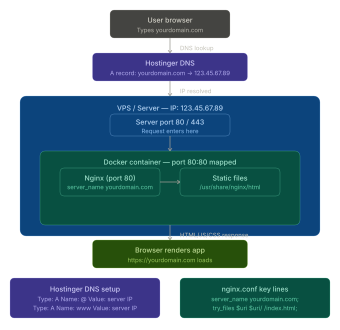
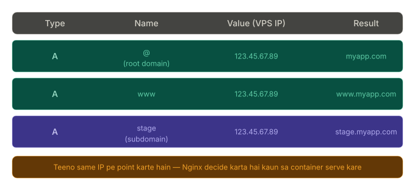
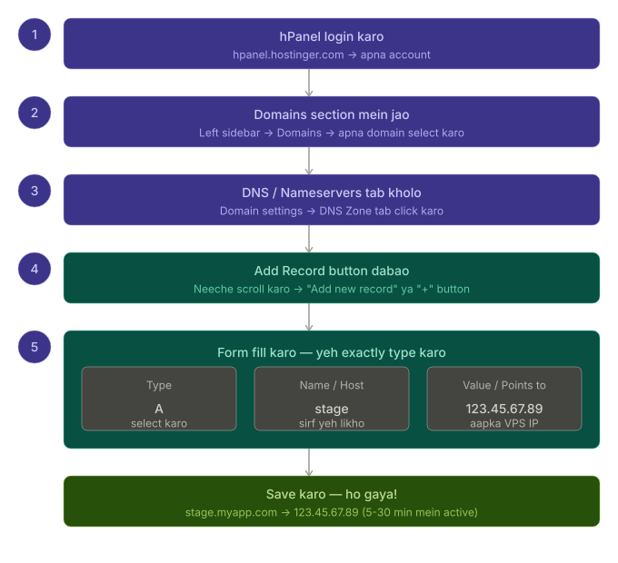

  

# CI/CD Pipelines for Node.js Projects

## Resources

| Diagram | Preview |
|---------|---------|
| [CI/CD with GitHub Actions](resources/cicd_github_actions_flow.svg) |  |
| [Dockerfile DevOps Flow](resources/dockerfile_devops_flow.svg) |  |
| [Domain to Docker Full Flow](resources/domain_to_docker_full_flow.svg) |  |
| [Why Nginx Exists](resources/why_nginx_exists.svg) |  |
| [Hostinger DNS Records](resources/hostinger_dns_records.svg) |  |
| [Hostinger Subdomain Steps](resources/hostinger_subdomain_steps.svg) |  |
