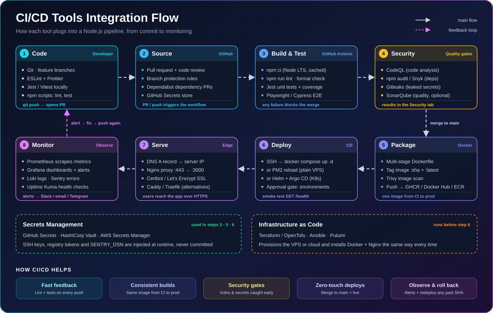

# CI/CD Integration Guide for Node.js

How the tools from the [tools list](README.md) fit together, what each stage does, and how to configure it.

<p align="center">
  
</p>

---

## How CI/CD Helps

| Without CI/CD | With CI/CD |
|---------------|------------|
| "Works on my machine" | The same Docker image runs in CI, staging, and prod |
| Bugs found by users | Lint and tests run on every push and PR |
| Vulnerable packages ship silently | CodeQL, npm audit, Gitleaks, and Trivy block them |
| Manual SSH + `git pull` deploys | Merging to `main` deploys automatically |
| Hard rollbacks | Every image is tagged by commit SHA, so you can redeploy any version |
| You learn about downtime from users | Prometheus, Grafana, and Uptime Kuma alert you first |

---

## Final Project Layout

```
my-node-app/
├── .github/
│   ├── workflows/ci-cd.yml      # Stages 3–6
│   └── dependabot.yml           # Stage 2
├── src/index.js                 # App with /health and /metrics
├── tests/app.test.js
├── Dockerfile                   # Stage 5
├── .dockerignore
├── eslint.config.js             # Stage 1
├── package.json
└── deploy/                      # Copied to the server (Stages 6–8)
    ├── docker-compose.yml
    ├── prometheus.yml
    └── nginx/app.conf
```

---

## Stage 1: Code (Developer)

**Tools:** Git, ESLint, Prettier, Jest/Vitest

```bash
npm i express prom-client @sentry/node
npm i -D eslint @eslint/js globals prettier jest supertest
```

**package.json** scripts. CI runs exactly these:

```json
{
  "scripts": {
    "start": "node src/index.js",
    "dev": "node --watch src/index.js",
    "lint": "eslint .",
    "format:check": "prettier --check .",
    "test": "jest"
  }
}
```

**eslint.config.js**

```js
const js = require('@eslint/js');
const globals = require('globals');

module.exports = [
  js.configs.recommended,
  { languageOptions: { globals: globals.node } },
  { files: ['tests/**/*.js'], languageOptions: { globals: globals.jest } },
];
```

**src/index.js**: the app exposes `/health` (used by the deploy smoke test and Uptime Kuma) and `/metrics` (scraped by Prometheus).

```js
const Sentry = require('@sentry/node');
Sentry.init({ dsn: process.env.SENTRY_DSN, tracesSampleRate: 0.2 }); // must run before other imports

const express = require('express');
const client = require('prom-client');

client.collectDefaultMetrics();
const app = express();

app.get('/health', (req, res) => res.json({ status: 'ok' }));
app.get('/metrics', async (req, res) => {
  res.set('Content-Type', client.register.contentType);
  res.end(await client.register.metrics());
});
app.get('/', (req, res) => res.send('Hello from CI/CD!'));

Sentry.setupExpressErrorHandler(app);

if (require.main === module) app.listen(process.env.PORT || 3000);
module.exports = app;
```

**tests/app.test.js**

```js
const request = require('supertest');
const app = require('../src/index');

test('GET /health returns ok', async () => {
  const res = await request(app).get('/health');
  expect(res.status).toBe(200);
  expect(res.body.status).toBe('ok');
});
```

---

## Stage 2: Source (GitHub)

**Tools:** GitHub, branch protection, Dependabot, GitHub Secrets

1. **Branch protection:** go to **Settings → Rules → Rulesets → New branch ruleset** and target `main`:
   - Require a pull request before merging
   - Require status checks to pass: `test`, `security`
   - Block force pushes
2. **Dependabot:** add `.github/dependabot.yml`:

```yaml
version: 2
updates:
  - package-ecosystem: npm
    directory: /
    schedule: { interval: weekly }
  - package-ecosystem: github-actions
    directory: /
    schedule: { interval: weekly }
  - package-ecosystem: docker
    directory: /
    schedule: { interval: weekly }
```

3. **Secrets:** go to **Settings → Secrets and variables → Actions**:

| Name | Type | Value |
|------|------|-------|
| `SSH_HOST` | Secret | Server IP |
| `SSH_USER` | Secret | Deploy user, e.g. `deploy` |
| `SSH_PRIVATE_KEY` | Secret | Private key whose public key is in the server's `~/.ssh/authorized_keys` |
| `APP_DOMAIN` | Variable | e.g. `app.example.com` |
| `GITHUB_TOKEN` | Automatic | Used to push to GHCR, no setup needed |

4. **Environment:** go to **Settings → Environments → New environment** and name it `production`. You can optionally add required reviewers for a manual approval gate.

---

## Stages 3–6: The Pipeline (`.github/workflows/ci-cd.yml`)

**Tools:** GitHub Actions, npm, Jest, CodeQL, npm audit, Gitleaks, Docker, Trivy, GHCR, SSH

```yaml
name: CI/CD

on:
  push:
    branches: [main]
  pull_request:
    branches: [main]

permissions:
  contents: read

jobs:
  # ---------- Stage 3: Build & Test ----------
  test:
    runs-on: ubuntu-latest
    steps:
      - uses: actions/checkout@v4
      - uses: actions/setup-node@v4
        with:
          node-version: lts/*
          cache: npm
      - run: npm ci
      - run: npm run lint
      - run: npm run format:check
      - run: npm test -- --coverage
      # E2E (optional): npx playwright install --with-deps && npx playwright test

  # ---------- Stage 4: Security ----------
  security:
    runs-on: ubuntu-latest
    permissions:
      contents: read
      security-events: write
    steps:
      - uses: actions/checkout@v4
        with:
          fetch-depth: 0 # Gitleaks scans full history
      - uses: gitleaks/gitleaks-action@v2
        env:
          GITHUB_TOKEN: ${{ secrets.GITHUB_TOKEN }}
      - run: npm audit --audit-level=high
      - uses: github/codeql-action/init@v3
        with:
          languages: javascript-typescript
      - uses: github/codeql-action/analyze@v3

  # ---------- Stage 5: Package ----------
  build:
    needs: [test, security]
    if: github.event_name == 'push' && github.ref == 'refs/heads/main'
    runs-on: ubuntu-latest
    permissions:
      contents: read
      packages: write
    steps:
      - uses: actions/checkout@v4
      - run: echo "IMAGE=ghcr.io/${GITHUB_REPOSITORY,,}" >> "$GITHUB_ENV" # GHCR needs lowercase
      - uses: docker/login-action@v3
        with:
          registry: ghcr.io
          username: ${{ github.actor }}
          password: ${{ secrets.GITHUB_TOKEN }}
      - uses: docker/setup-buildx-action@v3
      - uses: docker/build-push-action@v6
        with:
          context: .
          load: true
          tags: ${{ env.IMAGE }}:${{ github.sha }}
          cache-from: type=gha
          cache-to: type=gha,mode=max
      - name: Trivy image scan
        run: |
          docker run --rm -v /var/run/docker.sock:/var/run/docker.sock aquasec/trivy:latest \
            image --exit-code 1 --severity HIGH,CRITICAL --ignore-unfixed "$IMAGE:${{ github.sha }}"
      - name: Push image
        run: |
          docker tag "$IMAGE:${{ github.sha }}" "$IMAGE:latest"
          docker push "$IMAGE:${{ github.sha }}"
          docker push "$IMAGE:latest"

  # ---------- Stage 6: Deploy ----------
  deploy:
    needs: build
    runs-on: ubuntu-latest
    environment: production
    steps:
      - uses: appleboy/ssh-action@v1
        with:
          host: ${{ secrets.SSH_HOST }}
          username: ${{ secrets.SSH_USER }}
          key: ${{ secrets.SSH_PRIVATE_KEY }}
          script: |
            cd ~/app
            export IMAGE_TAG=${{ github.sha }}
            docker compose pull app
            docker compose up -d app
            docker image prune -f
      - name: Smoke test
        run: curl -fsS --retry 5 --retry-delay 5 "https://${{ vars.APP_DOMAIN }}/health"
```

> Check each action's latest major version before use, and pin third-party actions to a commit SHA for stronger supply-chain security.

**Optional add-ons:**
- **Snyk:** add a step `uses: snyk/actions/node@master` with `env: SNYK_TOKEN: ${{ secrets.SNYK_TOKEN }}`
- **SonarQube / SonarCloud:** add `SonarSource/sonarqube-scan-action` with `SONAR_TOKEN`
- **Gitleaks** is free for personal accounts. Organizations need a `GITLEAKS_LICENSE` secret.

---

## Stage 5: Package (Docker)

**Dockerfile** (multi-stage, runs as non-root, with a health check):

```dockerfile
FROM node:24-alpine AS deps
WORKDIR /app
COPY package*.json ./
RUN npm ci --omit=dev

FROM node:24-alpine
ENV NODE_ENV=production
WORKDIR /app
COPY --from=deps /app/node_modules ./node_modules
COPY . .
USER node
EXPOSE 3000
HEALTHCHECK --interval=30s CMD wget -qO- http://localhost:3000/health || exit 1
CMD ["node", "src/index.js"]
```

**.dockerignore**

```
node_modules
.git
.github
.env
coverage
tests
deploy
*.md
```

Registry alternatives: **Docker Hub** (`docker/login-action` with `DOCKERHUB_USERNAME` / `DOCKERHUB_TOKEN`) or **Amazon ECR** (`aws-actions/amazon-ecr-login`).

---

## Stage 6: Deploy (Server Setup)

### Provision the server with IaC (optional but repeatable)

**Terraform** (example: AWS EC2):

```hcl
provider "aws" { region = "ap-south-1" }

resource "aws_instance" "app" {
  ami           = var.ami_id        # Ubuntu LTS AMI
  instance_type = "t3.small"
  key_name      = var.key_name
  tags          = { Name = "nodejs-app" }
}

output "public_ip" { value = aws_instance.app.public_ip }
```

**Ansible** installs everything on the server (works for Hostinger or any VPS):

```yaml
- hosts: app
  become: true
  tasks:
    - name: Install Docker, Nginx, Certbot
      apt:
        name: [docker.io, docker-compose-v2, nginx, certbot, python3-certbot-nginx]
        update_cache: true
    - name: Allow deploy user to run Docker
      user: { name: "{{ ansible_user }}", groups: docker, append: true }
```

If you set up manually instead, SSH in and run the same `apt install`, then `sudo usermod -aG docker deploy`.

### One-time server steps

```bash
mkdir -p ~/app && cd ~/app                        # copy deploy/* here
echo "SENTRY_DSN=https://..." > .env              # runtime secrets live only on the server
echo <GHCR_PAT> | docker login ghcr.io -u <github-user> --password-stdin   # only if the image is private
docker compose up -d
```

### deploy/docker-compose.yml (app + monitoring)

```yaml
services:
  app:
    image: ghcr.io/ashukr321/my-node-app:${IMAGE_TAG:-latest}
    restart: unless-stopped
    env_file: .env
    ports: ["127.0.0.1:3000:3000"]   # only Nginx can reach it

  prometheus:
    image: prom/prometheus
    restart: unless-stopped
    volumes: ["./prometheus.yml:/etc/prometheus/prometheus.yml:ro"]
    ports: ["127.0.0.1:9090:9090"]

  grafana:
    image: grafana/grafana
    restart: unless-stopped
    volumes: ["grafana-data:/var/lib/grafana"]
    ports: ["127.0.0.1:3001:3000"]

  uptime-kuma:
    image: louislam/uptime-kuma:1
    restart: unless-stopped
    volumes: ["kuma-data:/app/data"]
    ports: ["127.0.0.1:3002:3001"]

volumes:
  grafana-data:
  kuma-data:
```

**Rollback:** redeploy any earlier commit:

```bash
cd ~/app && IMAGE_TAG=<old-commit-sha> docker compose up -d app
```

### Deploy alternatives

| Option | How |
|--------|-----|
| **PM2** (no Docker) | SSH script: `git pull && npm ci --omit=dev && pm2 reload ecosystem.config.js` |
| **Kubernetes + Helm** | CI runs `helm upgrade --install app ./chart --set image.tag=$SHA` |
| **Argo CD / Flux (GitOps)** | CI updates the image tag in a manifests repo, and Argo CD syncs the cluster automatically |

---

## Stage 7: Serve (DNS, Nginx, SSL)

1. **DNS:** add an A record pointing `app.example.com` to the server IP (see [Hostinger DNS records](../resources/hostinger_dns_records.svg) and [subdomain steps](../resources/hostinger_subdomain_steps.svg)).
2. **Nginx:** create `/etc/nginx/sites-available/app.conf` (see [why Nginx exists](../resources/why_nginx_exists.svg)):

```nginx
server {
    listen 80;
    server_name app.example.com;

    location /metrics { deny all; }   # Prometheus reads it internally

    location / {
        proxy_pass http://127.0.0.1:3000;
        proxy_set_header Host $host;
        proxy_set_header X-Real-IP $remote_addr;
        proxy_set_header X-Forwarded-For $proxy_add_x_forwarded_for;
        proxy_set_header X-Forwarded-Proto $scheme;
    }
}

server {
    listen 80;
    server_name grafana.example.com;
    location / { proxy_pass http://127.0.0.1:3001; proxy_set_header Host $host; }
}
```

```bash
sudo ln -s /etc/nginx/sites-available/app.conf /etc/nginx/sites-enabled/
sudo nginx -t && sudo systemctl reload nginx
```

3. **SSL:** Certbot rewrites the config for HTTPS and sets up auto-renewal:

```bash
sudo certbot --nginx -d app.example.com -d grafana.example.com
```

Alternatives: **Caddy** (automatic HTTPS with no Certbot) or **Traefik** (reads Docker labels, good for many containers).

---

## Stage 8: Monitor (Observe)

**deploy/prometheus.yml**

```yaml
global:
  scrape_interval: 15s
scrape_configs:
  - job_name: node-app
    metrics_path: /metrics
    static_configs:
      - targets: ["app:3000"]
```

| Tool | Setup |
|------|-------|
| **Grafana** | Open `https://grafana.example.com`, change the admin password, add a Prometheus data source at `http://prometheus:9090`, then import the dashboard **11159** (Node.js app) |
| **Grafana Alerts** | Alert rule `up{job="node-app"} == 0` for 1m, with a contact point for Email, Slack, or Telegram |
| **Uptime Kuma** | Reach it with `ssh -L 3002:localhost:3002 user@server`, then add an HTTP monitor for `https://app.example.com/health` |
| **Sentry** | Create a Node.js project, put its DSN in the server `.env` as `SENTRY_DSN`, and errors show up automatically |
| **Loki** (optional) | Add `grafana/loki` + `grafana/promtail` services to ship container logs into Grafana |

When an alert fires, fix the issue and push. The pipeline runs again, which is the feedback loop in the diagram.

---

## Setup Checklist

- [ ] Lint, format, and test scripts pass locally
- [ ] `main` ruleset requires PR + `test` + `security` checks
- [ ] `dependabot.yml` added
- [ ] Secrets `SSH_HOST`, `SSH_USER`, `SSH_PRIVATE_KEY` and variable `APP_DOMAIN` set
- [ ] `production` environment created
- [ ] Server provisioned (Terraform/Ansible or manual) with Docker, Nginx, Certbot
- [ ] `deploy/` files copied to `~/app`, `.env` created
- [ ] DNS A record points to the server, Nginx configured, SSL issued
- [ ] First push to `main` goes green end to end
- [ ] Grafana dashboard, alert rule, and Uptime Kuma monitor configured
